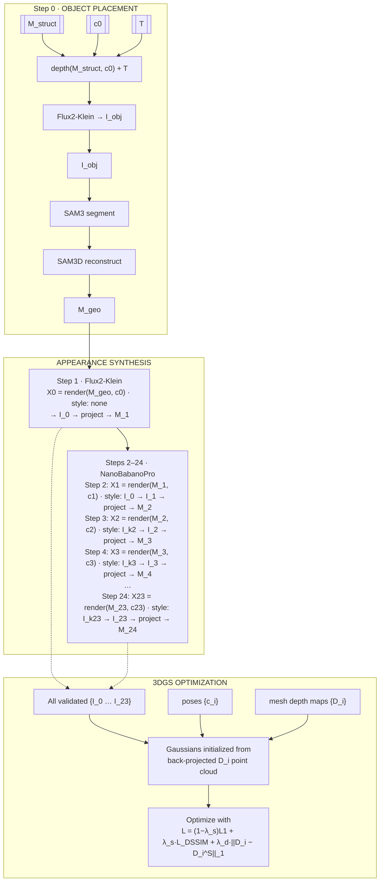

```mermaid
flowchart TB
  subgraph OP["Step 0 · OBJECT PLACEMENT"]
    direction TB
    MS[["M_struct"]]
    C0a[["c0"]]
    Ta[["T"]]
    DEPTH["depth(M_struct, c0) + T"]
    FK0["Flux2-Klein → I_obj"]
    IOBJ["I_obj"]
    SAM3["SAM3 segment"]
    SAM3D["SAM3D reconstruct"]
    MGEO["M_geo"]

    MS --> DEPTH
    C0a --> DEPTH
    Ta --> DEPTH
    DEPTH --> FK0 --> IOBJ --> SAM3 --> SAM3D --> MGEO
  end

  subgraph AS["APPEARANCE SYNTHESIS"]
    direction TB
    S1["Step 1 · Flux2-Klein<br/>X0 = render(M_geo, c0) · style: none<br/>→ I_0 → project → M_1"]

    S2["Steps 2–24 · NanoBabanoPro<br/>Step 2: X1 = render(M_1, c1) · style: I_0 → I_1 → project → M_2<br/>Step 3: X2 = render(M_2, c2) · style: I_k2 → I_2 → project → M_3<br/>Step 4: X3 = render(M_3, c3) · style: I_k3 → I_3 → project → M_4<br/>…<br/>Step 24: X23 = render(M_23, c23) · style: I_k23 → I_23 → project → M_24"]

    MGEO --> S1 --> S2
  end

  subgraph GS["3DGS OPTIMIZATION"]
    direction TB
    IMGS["All validated {I_0 … I_23}"]
    POSES["poses {c_i}"]
    DEPTHS["mesh depth maps {D_i}"]
    INIT["Gaussians initialized from<br/>back-projected D_i point cloud"]
    LOSS["Optimize with<br/>L = (1−λ_s)L1 + λ_s·L_DSSIM + λ_d·||D_i − D_i^S||_1"]

    IMGS --> INIT
    POSES --> INIT
    DEPTHS --> INIT
    INIT --> LOSS
  end

  S1 -.-> IMGS
  S2 -.-> IMGS
```
